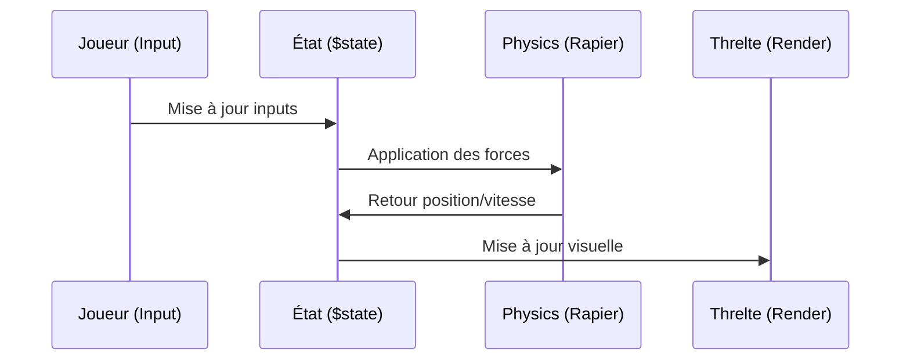

# ⚙️ Logique du Jeu

Fonctionnement interne de la reconversion Svelte 5 + Threlte ⚡

## 🎮 Boucle Principale & États

La logique est pilotée par les **Runes** de Svelte 5 pour une réactivité optimale.

## 🛠️ Composants Majeurs

### 1. PlayerController 🏎️
Gère les mouvements, le drift et les sauts.
- **Input**: Support Clavier, Gamepad et Touch.
- **Physique**: Utilise `@threlte/extras` et `@threlte/rapier`.

### 2. Système de Particules ✨
Réagit aux actions du joueur :
- **Drift**: Étincelles bleues/oranges/violettes.
- **Vitesse**: Effets de vent/flammes.
- **Impacts**: Éclats lors des collisions.

### 3. HUD (Heads-Up Display) 📊
- ✨ Affichage du score (pièces).
- 🕒 Chronomètre.
- 🏁 Position dans la course.

## 🔄 Flux de Données (Zustand -> Runes)

| React (Zustand) | Svelte 5 (Runes) |
| :--- | :--- |
| `useStore(state => state.input)` | `$state` dans un module `.svelte.ts` |
| `useEffect(() => ..., [deps])` | `$effect(() => ...)` |
| `useMemo(() => ..., [deps])` | `$derived(...)` |

---
🚀 *La puissance des runes permet de se passer de hooks complexes comme `useCallback` ou `useMemo` !*
