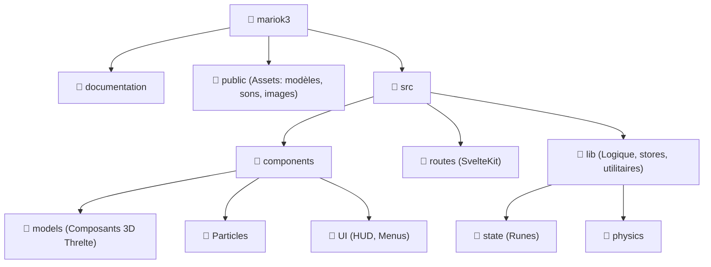

# 📂 Structure du Projet

Voici l'organisation actuelle et future de notre jeu Mario Kart Svelte 🏎️💨

## 🌳 Arborescence

## 📋 Détails des dossiers clés

| Dossier | Description |
| :--- | :--- |
| `public/models` | Contient les fichiers `.glb` originaux et transformés. 🧊 |
| `src/components/models` | Composants Svelte entourant les modèles 3D avec Threlte. 🧱 |
| `src/lib/state` | Gestion de l'état global avec les **Runes** (`$state`, `$derived`). 🧠 |
| `src/components/Particles` | Systèmes de particules pour les drifts, flammes, etc. ✨ |
| `src/components/UI` | Interface utilisateur (HUD, compteur de vitesse, classement). 🎮 |

---
💡 *Note: On garde la structure proche de l'originale pour faciliter la navigation.*
